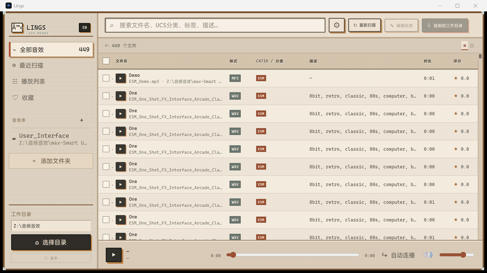

# Lings

> 我给自己做的一个本地音效库管理器：找声音、听声音，然后把需要的文件干净地复制到工作目录。

[](https://github.com/DevkyooW/Lings/releases)


我平时整理音效时，不太想先启动一个很重的素材管理系统，也不希望为了换台电脑又配置一遍环境。于是有了 **Lings**：它把音频索引保存在本地 SQLite 数据库里，打开文件夹就能扫描、搜索、试听和整理；便携版解压后直接运行，不需要另外安装 Node、Rust 或数据库。

目前这是一个面向 **Windows 10 / 11 x64** 的 Beta 项目。如果你也有一大堆散落在不同目录里的音效，希望它能帮你少翻几次文件夹。

## 界面预览



界面使用比较克制的复古像素风：保留终端感和硬边框，但没有大颗粒像素。英文使用 Cascadia Code，中文使用 OPPO Sans 4.0，两套字体都已封装在程序内。

## 它现在能做什么

### 扫描与查找

- 登记多个音效库文件夹，递归扫描其中的音频文件
- 按文件名、描述、标签和 UCS 字段搜索、排序
- 扫描过程显示当前路径与进度，可以随时取消
- 取消扫描会回滚本次改动，不会留下半份索引
- 文件或目录丢失时保留记录，并用灰色状态与红色问号提示

### 试听与整理

- 列表内直接试听，支持播放 / 暂停、进度和音量控制
- 选中曲目后按 `Space` 播放或暂停；多选时控制最后点选的曲目
- 播放列表、收藏、最近扫描视图
- 在文件管理器中定位原文件
- 将选中音效复制到工作目录；遇到同名文件会跳过，绝不覆盖
- 复制结束后显示成功与失败统计，详细日志阅后自动清理

### 元数据与 UCS

- 读取和编辑常规音频元数据
- 支持 **UCS 8.2.1** 字段与 WAV `iXML / ASWG` 信息
- 中文文件名、中文路径和中文元数据可以正常保存与显示
- 无法安全写回原文件的字段仍会保存在本地数据库中

### 数据库与日常使用

- 所有索引都在本地，不上传音频、路径或元数据
- 支持导出数据库备份
- 可以只清除扫描结果，不会删除实际音频文件
- 删除音效库登记时只移除数据库记录，不碰原目录
- 浅色 / 深色主题跟随 Windows 系统配色自动切换
- 中英文界面可随时切换

## 下载

前往 [Releases](https://github.com/DevkyooW/Lings/releases) 下载最新 Beta：

| 文件 | 适合谁 |
| --- | --- |
| `Lings-portable.exe` | 想直接运行，或把程序和数据库一起放在移动硬盘里 |
| `Lings_0.1.0_x64-setup.exe` | 希望使用普通安装向导 |
| `Lings_0.1.0_x64_en-US.msi` | 需要 MSI 安装包或集中部署 |

便携版数据库会创建在程序同级的 `Lings_db/lings.db`。安装版数据库默认位于安装目录的 `database/lings.db`。建议在导入大量素材后，从设置页导出一份数据库备份。

> [!NOTE]
> Beta 版本仍在持续调整数据库和大规模列表性能。重要素材请保留原文件；Lings 的删除、清库操作本身不会删除这些原文件。

## 音频格式

扫描器目前识别这些常见格式：

`WAV` · `MP3` · `FLAC` · `Ogg/Vorbis` · `Opus` · `M4A/MP4` · `AAC` · `AIFF` · `WMA` · `APE` · `WavPack` · `CAF` · `AC3` · `AMR` · `MIDI`

格式能够被扫描，不一定代表 Windows WebView 对它具备原生解码能力。实际试听能力取决于系统解码器；WAV、AIFF、ID3、Vorbis、FLAC、MP4 等 Lofty 支持的标签格式可以写回，其他信息保存在数据库侧车中。

## 从源码运行

需要先安装 Node.js、Rust 和 Tauri 在 Windows 上要求的构建工具。

```powershell
git clone https://github.com/DevkyooW/Lings.git
cd Lings
npm install
npm run tauri dev
```

生成 Release 构建：

```powershell
npm run tauri build
```

输出位于 `src-tauri/target/release/` 及其 `bundle` 子目录。

## 字体与授权

Lings 内置了以下字体，完整授权文本也可以在程序的“关于”页面中滚动查看：

- [Cascadia Code](https://github.com/microsoft/cascadia-code?tab=License-1-ov-file) — SIL Open Font License 1.1
- [OPPO Sans 4.0](https://www.coloros.com/article/A00000074/) — OPPO Sans 字体许可协议

项目源码按照 [Apache License 2.0](LICENSE) 发布。

---

如果你在真实音效库中遇到扫描、编码、UCS 标签或复制流程的问题，欢迎开一个 [Issue](https://github.com/DevkyooW/Lings/issues)。最好附上文件格式、操作步骤和错误日志，但请先删掉不方便公开的本地路径。
